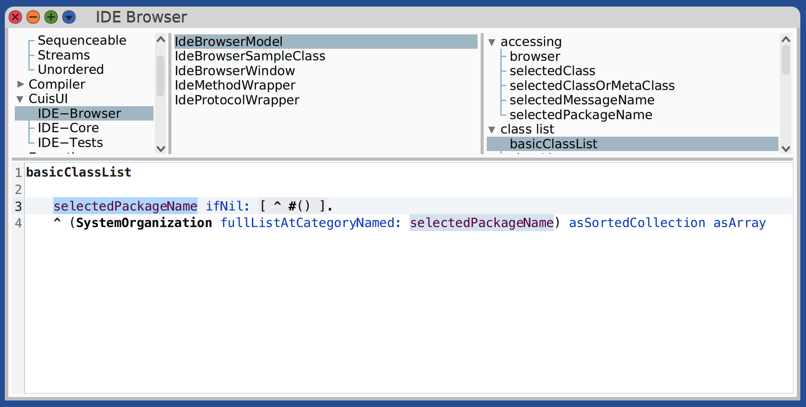

# Cuis UI Workspace

Workspace vivo para construir una experiencia de IDE Morphic sobre Cuis Smalltalk.

## Características principales

- **Browser jerárquico**: panel con packages, clases y protocolos/métodos ordenados por jerarquía.
- **Editor especializado**: `IdeCodePaneMorph` envuelve a `SmalltalkEditor` con gutter propio, resaltado temático y overlay de quick actions.
- **Quick actions**: `IdeQuickActionController` coordina providers (p. ej. toggles de breakpoints) y muestra la lamparita contextual.
- **Breakpoints de método**: integración con `BreakingMethodWrapper` para activar/desactivar desde el popup.
- **Suite automática**: 35 tests cubren modelo, ventana, providers y full UI wiring (`CuisUI-IDE-Tests`).

## Requisitos

```bash
git clone https://github.com/Cuis-Smalltalk/Cuis-Smalltalk-Dev.git
git clone https://github.com/gstn-caruso/cuis-ui.git
```

- Imagen Cuis 7.7 (#7777+)

## Inicio rápido

1. En la imagen Cuis, fileIn `scripts/install-cuis-ui-packages.st` y elegí el directorio del repo.
2. Abrí el browser:

   ```smalltalk
   IdeBrowserWindow open
   ```

3. Explora packages | clases | protocolos/métodos y probá las quick actions.

El script vive en `scripts/install-cuis-ui-packages.st` para volver a instalar los packages cuando sincronices el repo.

## Estructura del repo

- `CuisUI-IDE-Core.pck.st`: morphs del editor, tema, overlay, gutter y controladores de quick actions.
- `CuisUI-IDE-Browser.pck.st`: `IdeBrowserModel`, `IdeBrowserWindow` y wrappers de árbol/lista.
- `CuisUI-IDE-Tests.pck.st`: suite automatizada con doubles (`IdeFakeKeyboardEvent`, `IdeFakeQuickActionProvider`, etc.).
- `scripts/install-cuis-ui-packages.st`: fileIn interactivo para instalar Core, Browser y Tests.

## Flujo de trabajo recomendado

1. Editá en la imagen (Browser o Workspace).
2. Tests rápidos:

   ```smalltalk
   #(IdeBrowserModelTest IdeBrowserWindowTest IdeMethodBreakpointActionProviderTest
     IdeQuickActionContextTest IdeQuickActionControllerTest IdeQuickActionTest)
     do: [:each | (TestSuite forTestCaseClass: (Smalltalk at: each)) run ].
   ```

3. Persistí antes de git:

   ```smalltalk
   #( 'CuisUI-IDE-Core' 'CuisUI-IDE-Browser' 'CuisUI-IDE-Tests' )
     do: [:pkg | (CodePackage installedPackages at: pkg) save ].
   ```

4. `git status`, `git commit`, `git push`.

## Estado actual

- `IdeBrowserWindow open` presenta los tres paneles y el editor con gutter.


